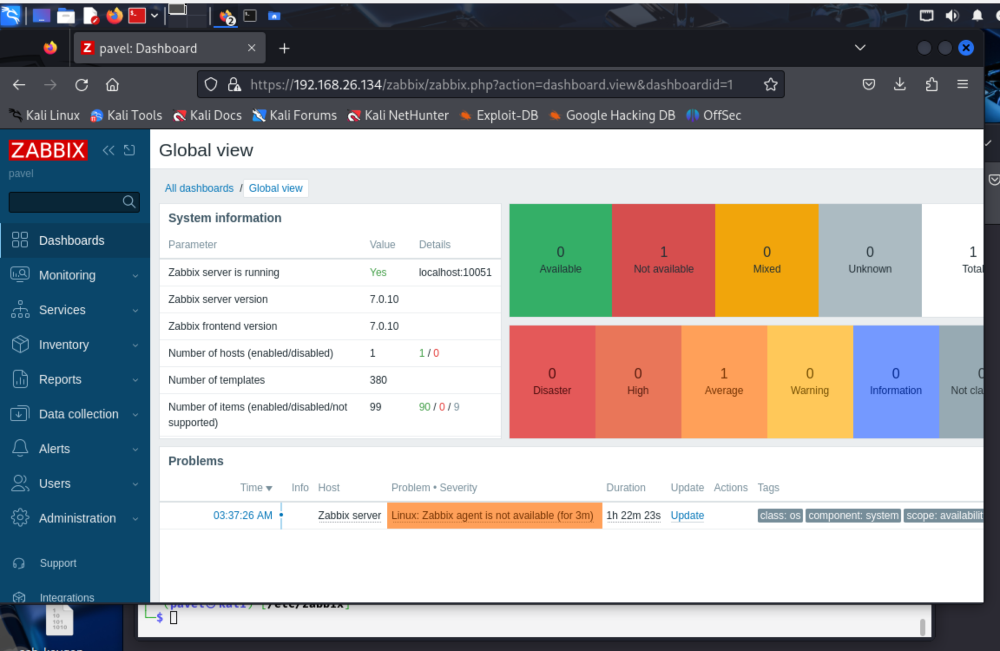
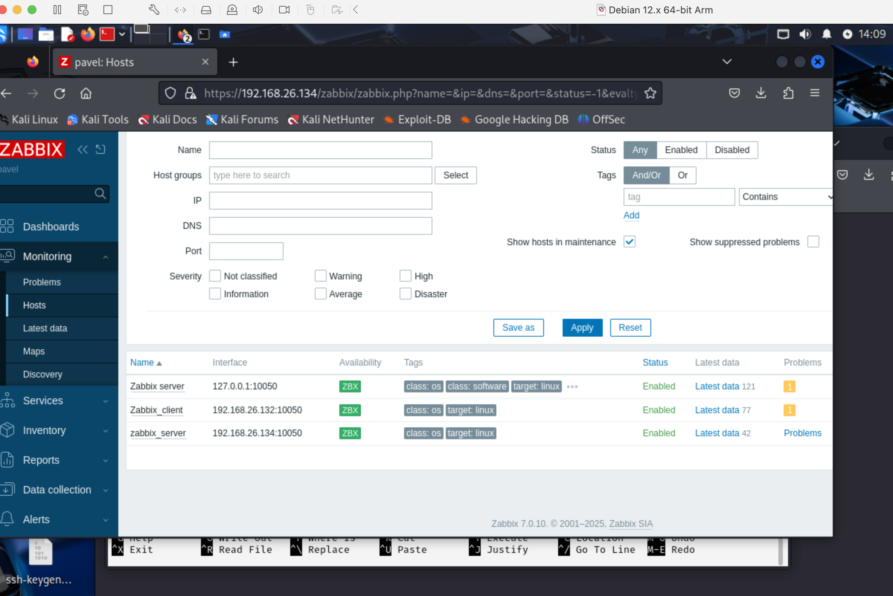
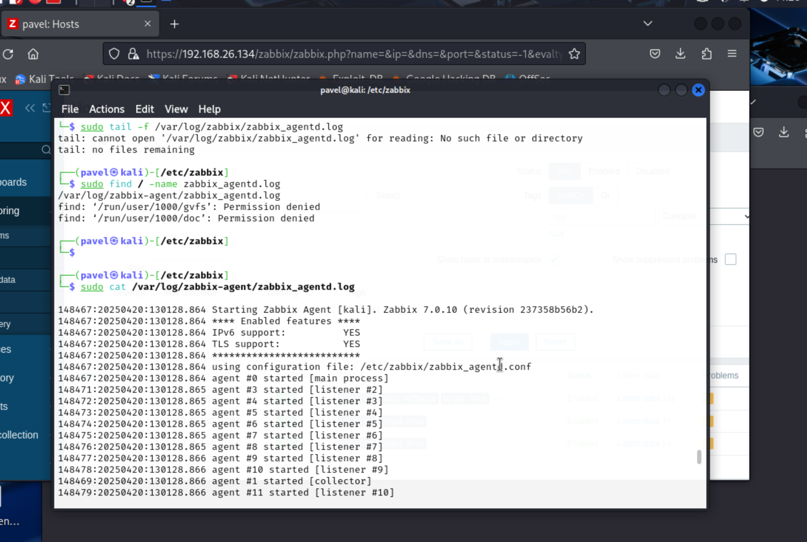
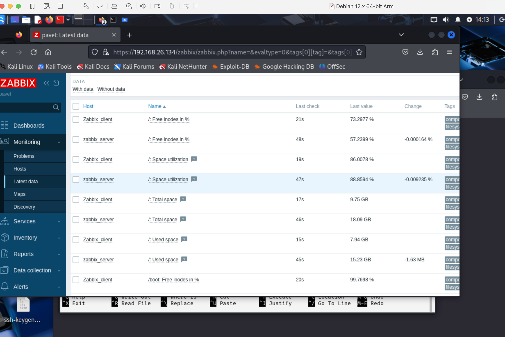

# Домашнее задание к занятию "`Система мониторинга Zabbix`" - `Решетов Павел`


### Инструкция по выполнению домашнего задания

   1. Сделайте `fork` данного репозитория к себе в Github и переименуйте его по названию или номеру занятия, например, https://github.com/имя-вашего-репозитория/git-hw или  https://github.com/имя-вашего-репозитория/7-1-ansible-hw).
   2. Выполните клонирование данного репозитория к себе на ПК с помощью команды `git clone`.
   3. Выполните домашнее задание и заполните у себя локально этот файл README.md:
      - впишите вверху название занятия и вашу фамилию и имя
      - в каждом задании добавьте решение в требуемом виде (текст/код/скриншоты/ссылка)
      - для корректного добавления скриншотов воспользуйтесь [инструкцией "Как вставить скриншот в шаблон с решением](https://github.com/netology-code/sys-pattern-homework/blob/main/screen-instruction.md)
      - при оформлении используйте возможности языка разметки md (коротко об этом можно посмотреть в [инструкции  по MarkDown](https://github.com/netology-code/sys-pattern-homework/blob/main/md-instruction.md))
   4. После завершения работы над домашним заданием сделайте коммит (`git commit -m "comment"`) и отправьте его на Github (`git push origin`);
   5. Для проверки домашнего задания преподавателем в личном кабинете прикрепите и отправьте ссылку на решение в виде md-файла в вашем Github.
   6. Любые вопросы по выполнению заданий спрашивайте в чате учебной группы и/или в разделе “Вопросы по заданию” в личном кабинете.
   
Желаем успехов в выполнении домашнего задания!
   
### Дополнительные материалы, которые могут быть полезны для выполнения задания

1. [Руководство по оформлению Markdown файлов](https://gist.github.com/Jekins/2bf2d0638163f1294637#Code)

---

### Задание 1

Установите Zabbix Server с веб-интерфейсом.

Процесс выполнения

1. Выполняя ДЗ, сверяйтесь с процессом отражённым в записи лекции.
2. Установите PostgreSQL. Для установки достаточна та версия, что есть в системном репозитороии Debian 11.
3. Пользуясь конфигуратором команд с официального сайта, составьте набор команд для установки последней версии Zabbix с поддержкой PostgreSQL и Apache.
4. Выполните все необходимые команды для установки Zabbix Server и Zabbix Web Server.

Требования к результатам

Прикрепите в файл README.md скриншот авторизации в админке.
Приложите в файл README.md текст использованных команд в GitHub.##

```

`При необходимости прикрепитe сюда скриншоты`


### Использованные команды Git:
git clone https://github.com/netology-code/sys-pattern-homework    
git remote remove origin
git remote add origin https://github.com/Saint-Pablo-3/zabbix-hw.git
git push -u origin main

---

### Задание 2

Установите Zabbix Agent на два хоста.

### Процесс выполнения

1. Установлены Zabbix Agent на две виртуальные машины:
   - одна из них — сервер Zabbix  
   - вторая — отдельный клиент
2. В конфигурации `zabbix_agentd.conf` на обоих хостах:
   - указан IP-адрес сервера Zabbix в параметрах `Server` и `ServerActive`
   - установлен уникальный `Hostname`
3. Агенты добавлены через `Configuration > Hosts` в веб-интерфейсе Zabbix
4. Привязаны шаблоны `Template OS Linux by Zabbix agent`
5. Проверено поступление метрик в `Monitoring > Latest Data`

Требования к результатам

Приложите в файл README.md скриншот раздела Configuration > Hosts, где видно, что агенты подключены к серверу
Приложите в файл README.md скриншот лога zabbix agent, где видно, что он работает с сервером
Приложите в файл README.md скриншот раздела Monitoring > Latest data для обоих хостов, где видны поступающие от агентов данные.
Приложите в файл README.md текст использованных команд в GitHub

### Скриншоты:








### Использованные команды Git:

git add .
git commit -m "all tasks is done"
git push origin main
yaml
Копировать
Редактировать

---

